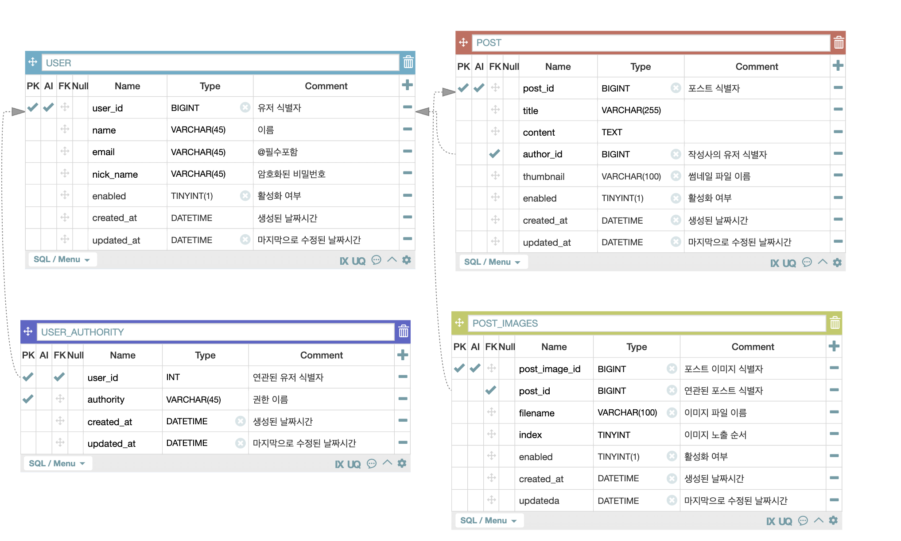

= 원티드 프리온보딩 백엔드 인턴십 - 선발 과제
:hardbreaks:
:doctype: article
:source-highlighter: highlightjs
:toc:

- 지원자 성명: 김수현
- 환경:
** aws ec2: ec2-52-78-148-180.ap-northeast-2.compute.amazonaws.com
- 어플리케이션의 실행 방법:
- 엔드포인트 호출 방법:
- 데이터베이스 테이블 구조:

- 구현한 API 동작을 촬영한 데모 영상 링크:

== API 명세

=== 과제 1. 사용자 회원가입

.sample http request
include::docs/mock-api-test/test_create_post/http-request.adoc[]

=======================
요청 헤더 포함 내역
include::docs/mock-api-test/test_create_post/request-headers.adoc[]
요청 본문 포함 내역
include::docs/mock-api-test/test_create_post/request-fields.adoc[]
=======================

.sample http response
include::docs/mock-api-test/test_create_post/http-response.adoc[]

=======================
응답 헤더 포함 내역
include::docs/mock-api-test/test_create_post/response-headers.adoc[]
=======================

=== 과제 2. 사용자 로그인

.sample http request
include::docs/mock-api-test/test_login/http-request.adoc[]

=======================
요청 본문 포함 내역
include::docs/mock-api-test/test_login/request-fields.adoc[]
=======================

.sample http response
include::docs/mock-api-test/test_login/http-response.adoc[]

=======================
응답 헤더 포함 내역
include::docs/mock-api-test/test_login/response-headers.adoc[]
=======================

=== 과제 3. 새로운 게시글을 생성

.sample http request
include::docs/mock-api-test/test_create_post/http-request.adoc[]

=======================
요청 헤더 포함 내역
include::docs/mock-api-test/test_create_post/request-headers.adoc[]
요청 본문 포함 내역
include::docs/mock-api-test/test_create_post/request-fields.adoc[]
=======================

.sample http response
include::docs/mock-api-test/test_create_post/http-response.adoc[]

=======================
응답 헤더 포함 내역
include::docs/mock-api-test/test_create_post/response-headers.adoc[]
=======================

=== 과제 4. 게시글 목록을 조회

.sample http request
include::docs/mock-api-test/test_list/http-request.adoc[]

=======================
요청 파라미터
include::docs/mock-api-test/test_list/request-parameters.adoc[]
=======================

.sample http response
include::docs/mock-api-test/test_list/http-response.adoc[]

=======================
응답 본문 포함 내역
include::docs/mock-api-test/test_list/response-fields.adoc[]
=======================

=== 과제 5. 특정 게시글을 조회

.sample http request
include::docs/mock-api-test/test_get/http-request.adoc[]

=======================
요청 경로 파라미터
include::docs/mock-api-test/test_get/path-parameters.adoc[]
=======================

.sample http response
include::docs/mock-api-test/test_get/http-response.adoc[]

=======================
응답 본문 포함 내역
include::docs/mock-api-test/test_get/response-fields.adoc[]
=======================

=== 과제 6.  특정 게시글을 수정

.sample http request
include::docs/mock-api-test/test_update_post/http-request.adoc[]

=======================
요청 경로 파라미터
include::docs/mock-api-test/test_update_post/path-parameters.adoc[]
요청 헤더 포함 내역
include::docs/mock-api-test/test_update_post/request-headers.adoc[]
요청 본문 포함 내역
include::docs/mock-api-test/test_update_post/request-fields.adoc[]
=======================

.sample http response
include::docs/mock-api-test/test_update_post/http-response.adoc[]

=== 과제 7.  특정 게시글을 삭제

.sample http request
include::docs/mock-api-test/test_delete_post/http-request.adoc[]

=======================
요청 경로 파라미터
include::docs/mock-api-test/test_delete_post/path-parameters.adoc[]
요청 헤더 포함 내역
include::docs/mock-api-test/test_delete_post/request-headers.adoc[]
=======================

.sample http response
include::docs/mock-api-test/test_delete_post/http-response.adoc[]

